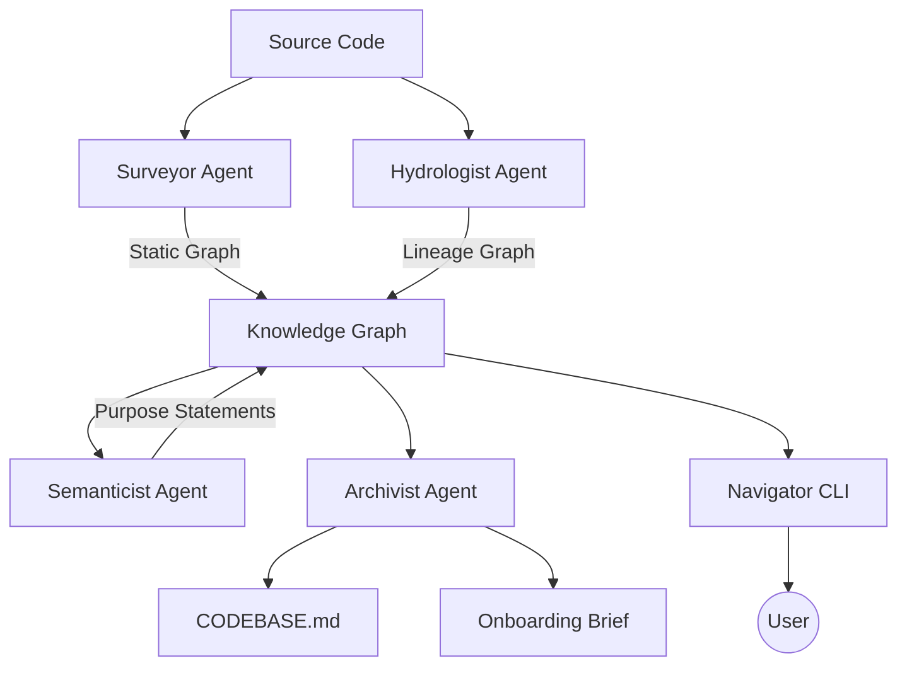

# 🗺️ The Brownfield Cartographer

**Engineering Codebase Intelligence Systems for Rapid FDE Onboarding in Production Environments.**

[](https://www.python.org/downloads/)


The **Brownfield Cartographer** is a multi-agent codebase intelligence system designed to ingest any repository and produce a living, queryable knowledge graph of its architecture, data flows, and semantic structure. It is the essential tool for Forward Deployed Engineers (FDEs) who need to become productive in massive, unfamiliar codebases within 72 hours.

---

## 🚀 Key Features

*   **Static Surveyor:** Deep AST analysis using Tree-sitter to build module graphs, detect circular dependencies, and identify architectural hubs (via PageRank).
*   **Hydrologist (Data Lineage):** Tracks data flow across Python (Pandas/Spark), SQL (Sqlglot-parsed), and YAML (Airflow/dbt) boundaries.
*   **Semantic Purpose Extraction:** (Future) LLM-powered module summarization that focuses on *business intent* rather than implementation detail.
*   **Living Context (CODEBASE.md):** (Future) Auto-updates a persistent context file for injection into AI coding agents.
*   **Navigator Agent:** (Future) Interactive query interface to explore blast radius, lineage, and implementation details.

---

## 📂 Architecture

The system follows a multi-agent orchestration pattern:



---

## 🛠️ Installation

### Using uv
```bash
# Clone the repository
git clone https://github.com/yosef-zewdu/Brownfield-Cartographer.git
cd Brownfield-Cartographer

# Install dependencies and create virtual environment
uv sync
```

### Using Docker
```bash
# Build the image
docker build -t cartographer .

# Run analysis on a local repository
docker run -v /path/to/target/repo:/repo cartographer analyze /repo
```

---

## 📖 Usage

### 1. Analyze a Repository
Generate the architectural and data flow maps for a codebase.
```bash
uv run src/cli.py analyze /path/to/repo --output .cartography
```

### 2. Query the Codebase (Coming Soon)
Explore the system via natural language queries.
```bash
uv run src/cli.py query "What is the primary data ingestion path?"
```

---

## 📈 Roadmap

- [x] **Phase 1: Surveyor Agent** - Static analysis, PageRank, Git velocity.
- [ ] **Phase 2: Hydrologist Agent** - SQL parsing, dbt/Airflow DAG support.
- [ ] **Phase 3: Semanticist Agent** - LLM integration, Domain clustering.
- [ ] **Phase 4: Archivist & Navigator** - CODEBASE.md generation and interactive CLI.

---

