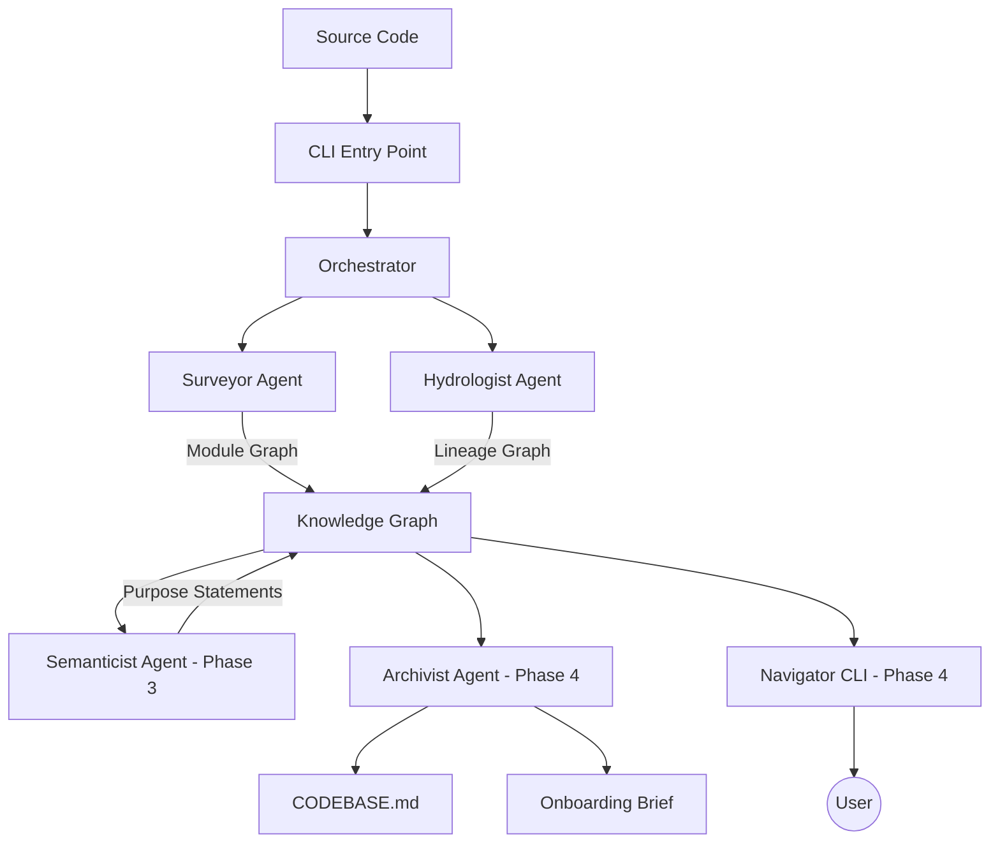

# 🗺️ The Brownfield Cartographer

**Engineering Codebase Intelligence Systems for Rapid FDE Onboarding in Production Environments.**

[](https://www.python.org/downloads/)


The **Brownfield Cartographer** is a multi-agent codebase intelligence system designed to ingest any repository and produce a living, queryable knowledge graph of its architecture, data flows, and semantic structure. 
---

##  Key Features

*   **Static Surveyor:** Deep AST analysis using Tree-sitter to build module graphs, detect circular dependencies, and identify architectural hubs (via PageRank).
*   **Hydrologist (Data Lineage):** Tracks data flow across Python (Pandas/PySpark), SQL (Sqlglot-parsed), and YAML (Airflow/dbt) boundaries with full provenance tracking.
*   **Multi-Framework Support:** Automatically detects and analyzes dbt models, Airflow DAGs, SQLAlchemy operations, and more.
*   **Provenance Tracking:** Every extracted relationship includes evidence type, confidence score, and resolution status for full auditability.
*   **CLI Interface:** Simple command-line tool for analyzing repositories and generating comprehensive reports.
*   **Semantic Purpose Extraction:** (Phase 3) LLM-powered module summarization that focuses on *business intent* rather than implementation detail.
*   **Living Context (CODEBASE.md):** (Phase 4) Auto-updates a persistent context file for injection into AI coding agents.
*   **Navigator Agent:** (Phase 4) Interactive query interface to explore blast radius, lineage, and implementation details.

---

##  Architecture

The system follows a multi-agent orchestration pattern:



---

##  Installation

### Prerequisites
- Python 3.12+
- Git (for git velocity analysis)

### Using uv (Recommended)
```bash
# Clone the repository
git clone https://github.com/yosef-zewdu/Brownfield-Cartographer.git
cd Brownfield-Cartographer

# Install dependencies and create virtual environment
uv sync
```


### Using Docker
```bash
# Build the image
docker build -t cartographer .

# Run analysis on a local repository
docker run -v /path/to/target/repo:/repo cartographer analyze /repo
```

---

##  Usage

### Quick Start

Analyze any repository with a single command:

```bash
# Full analysis (Surveyor + Hydrologist)
uv run python -m src.cli analyze /path/to/repository

# Or with Docker
docker run -v /path/to/repo:/repo cartographer analyze /path/to/repository
```

This will create a `.cartography/` directory in the target repository with:
- `module_graph.json` - Complete module dependency graph
- `lineage_graph.json` - Complete data lineage graph
- `surveyor_report.txt` - Module structure analysis
- `hydrologist_report.txt` - Data lineage analysis

### Command-Line Interface

```bash
# Show help
uv run python -m src.cli --help

# Analyze with custom output directory
uv run python -m src.cli analyze /path/to/repo --output-dir .analysis

# Skip Surveyor phase (use existing module graph)
uv run python -m src.cli analyze /path/to/repo --skip-surveyor

# Run only Surveyor (skip Hydrologist)
uv run python -m src.cli analyze /path/to/repo --skip-hydrologist
```

### Example: Analyze dbt Project

```bash
uv run python -m src.cli analyze ~/projects/jaffle-shop
```

**Output:**
```
================================================================================
BROWNFIELD CARTOGRAPHER - ANALYSIS PIPELINE
================================================================================

Repository: /home/user/projects/jaffle-shop
Output directory: /home/user/projects/jaffle-shop/.cartography
Started at: 2026-03-11 23:09:18
--------------------------------------------------------------------------------

[PHASE 1] Running Surveyor Agent...
✓ Surveyor complete:
  - Modules analyzed: 37
  - Graph nodes: 37
  - Graph edges: 0

[PHASE 2] Running Hydrologist Agent...
✓ Hydrologist complete:
  - Datasets discovered: 19
  - Transformations discovered: 15
  - Lineage graph nodes: 34
  - Lineage graph edges: 30

================================================================================
ANALYSIS COMPLETE
================================================================================

✓ All phases completed successfully
```

### Example: Analyze Apache Airflow

```bash
uv run python -m src.cli analyze ~/projects/airflow
```

For large codebases (7,500+ modules), analysis takes ~7-10 minutes and produces:
- 6,174 lineage nodes
- 772 lineage edges
- 2,263 Airflow tasks detected
- 2,984 SQLAlchemy operations
- Full provenance tracking

---

## Supported Frameworks

The Cartographer automatically detects and analyzes:

### Data Transformation Frameworks
- **dbt**: Models, sources, refs, schema metadata
- **Apache Airflow**: DAGs, tasks, dependencies
- **SQL**: Raw SQL queries and table references

### Data Processing Libraries
- **Pandas**: read_csv, read_sql, to_csv, to_sql, etc.
- **PySpark**: read, write operations
- **SQLAlchemy**: execute, query operations

### Languages
- **Python**: .py files (AST analysis via tree-sitter)
- **SQL**: .sql files (multi-dialect parsing via sqlglot)
- **YAML**: .yaml, .yml files (Airflow/dbt configs)
- **JavaScript/TypeScript**: .js, .ts files

---

## Output Artifacts

All outputs are saved to `<repository>/.cartography/`:

### 1. module_graph.json
Complete module dependency graph with:
- All source files analyzed
- Import relationships
- Module metadata (complexity, change velocity)
- PageRank scores for architectural hubs
- Circular dependency detection

### 2. lineage_graph.json
Data lineage graph with:
- Dataset nodes (tables, files, streams)
- Transformation nodes (dbt models, Airflow tasks, SQL queries)
- CONSUMES and PRODUCES edges
- Full provenance metadata (evidence type, confidence, resolution status)

### 3. surveyor_report.txt
Human-readable summary:
- Module count and language breakdown
- Complexity analysis
- Circular dependencies
- Dead code candidates
- Git velocity analysis

### 4. hydrologist_report.txt
Human-readable summary:
- Dataset and transformation counts
- Transformation type breakdown
- Storage type distribution
- Data flow analysis (sources and sinks)

---

##  Validation Results

The Cartographer has been validated on:

### dbt jaffle-shop (Small Project)
- ✓ 37 modules analyzed
- ✓ 19 datasets, 15 transformations
- ✓ All 12 dbt model dependencies correctly extracted
- ✓ 100% accuracy vs expected lineage
- ✓ Execution time: ~1 second

### Apache Airflow (Large Project)
- ✓ 7,538 modules analyzed
- ✓ 2,012 datasets, 7,812 transformations
- ✓ 2,263 Airflow tasks across 520 DAGs
- ✓ Multi-framework detection (SQLAlchemy, PySpark, Pandas)
- ✓ Execution time: ~7 minutes

See [HYDROLOGIST_VALIDATION_SUMMARY.md](HYDROLOGIST_VALIDATION_SUMMARY.md) for detailed validation results.

---

##  Roadmap

- [x] **Phase 1: Surveyor Agent** - Static analysis, PageRank, Git velocity
- [x] **Phase 2: Hydrologist Agent** - SQL parsing, dbt/Airflow DAG support, provenance tracking
- [x] **CLI & Orchestrator** - Command-line interface and pipeline orchestration
- [ ] **Phase 3: Semanticist Agent** - LLM integration, Domain clustering
- [ ] **Phase 4: Archivist & Navigator** - CODEBASE.md generation and interactive CLI

---

##  Documentation

- [CLI Usage Guide](docs/CLI_USAGE.md) - Complete command-line reference
- [Validation Summary](docs/HYDROLOGIST_VALIDATION_SUMMARY.md) - Testing results

---
